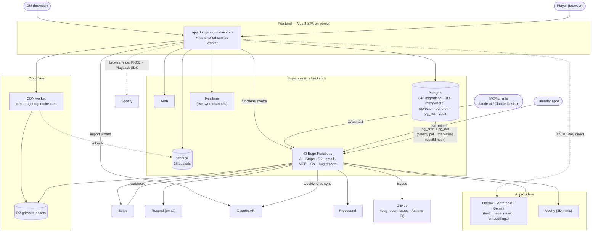

# Grimoire Architecture — Start Here

The whole landscape on one screen, then a triage table for outages. Depth
lives in three focused docs — read only the one your problem points at:

| Doc | Covers |
| --- | --- |
| [internal.md](internal.md) | Frontend layers, state model, data-access verbs, realtime sync, service worker |
| [integrations.md](integrations.md) | Every third party: call direction, credentials, failure symptoms |
| [release-pipeline.md](release-pipeline.md) | CI/CD, the two deploy pipelines, the three skew windows |
| [boundary-drift.md](boundary-drift.md) | Where the code already deviates from this map — verified holds, known breaks, re-run instructions |

Per-feature depth (file paths, tables, composables) stays in
[`../features/`](../features/index.md); DB security rules in `CLAUDE.md`.
Diagrams are Mermaid — they render on GitHub and diff like code. **Keep them
current: if you change a boundary (new provider, new edge function category,
new deploy step), update the diagram in the same PR.**

## System context

Solid arrows: the normal request direction. Dashed: browser-direct paths
that bypass edge functions — these fail without anything appearing in
Supabase logs.

## Outage triage — symptom → first place to look

**Sentry (EU) reports errors only** — frontend exceptions and unhandled edge
errors thrown through `withCors` (#644). There is still no analytics. It does
not see Postgres, Stripe webhooks, or the four functions that skip `withCors`,
so the five dashboards remain the rest of the surface: Supabase (edge logs,
Postgres, Auth), Stripe, Vercel, GitHub Actions, plus user bug reports. Start
from the symptom:

| Symptom | Likely system | Look at |
| --- | --- | --- |
| Nobody can log in / everything 401s | Supabase Auth | Supabase status + Auth logs; then `stores/auth.ts` session refresh |
| One feature's list empty or stale, rest fine | RLS / composable / realtime | The feature's composable → RLS policy; if only *live updates* broken → `SYNC_TABLES` in `campaignLiveSync` ([internal.md](internal.md)) |
| Players don't see DM changes until reload | Realtime channel | `realtimeChannel.ts` heal/status, then Supabase Realtime health |
| AI generation fails for everyone | Provider or credits | Edge logs for the `generate-*` fn; provider status; `provider_config` table |
| AI generation fails for one campaign only | BYOK | Their vaulted key (`api-key-vault`), browser console — never in edge logs |
| Credits stuck "held" | Cron | `release-stale-credit-holds` / `fail-stale-*` pg_cron jobs |
| Minis stuck "sculpting" | Meshy poll loop | `poll-meshy-jobs` cron + `SIMULACRUM_POLLER_TOKEN`; then Meshy status (assets expire after 3 days!) |
| Paid but no Pro / no credits | Stripe webhook | Stripe dashboard delivery → event parity (`stripe:check`) → `stripe-webhook` logs ([integrations.md](integrations.md)) |
| Images broken site-wide | CDN / storage | `VITE_ASSET_CDN_URL` set? → CDN worker (`infra/`) → R2 → Supabase Storage fallback |
| New UI errors on missing column/RPC | Deploy skew | Vercel deploy time vs `production-release` run — skew window 1 in [release-pipeline.md](release-pipeline.md) |
| Edge fn errors on missing column | Deploy skew | Skew window 2: `db push` landed, `functions deploy` failed — re-run the job |
| Release red on migration push | Version arithmetic | `scripts/check-migration-versions.sh`; rename the migration forward |
| "Unknown creature" / dangling refs | Content identity | `supabase/checks/content_integrity.sql` gate output |
| User stuck on old build after deploy | SW update deferral | [internal.md](internal.md) § Service worker — deferred reload, not a deploy failure |
| Import wizard empty/hanging | Open5e | api.open5e.com availability |
| Notification emails not arriving | Resend | `send-notification-email` logs; `RESEND_API_KEY` unset = silent no-op |
| Soundboard search dead | Freesound | `freesound-search` edge fn → Freesound API |
| Spotify won't play | Browser-side | `spotifyAuth.ts` token flow; Premium required; never in edge logs |
