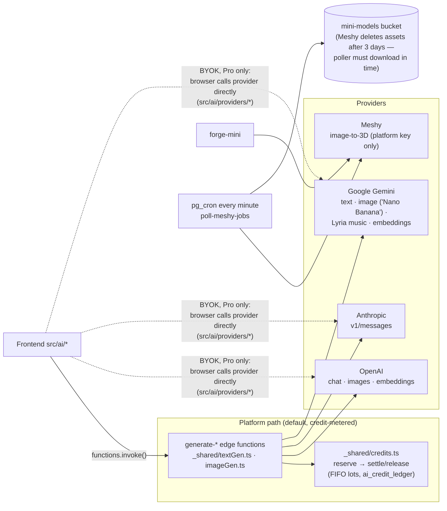
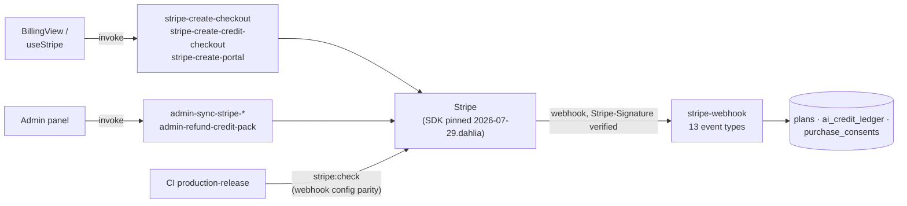
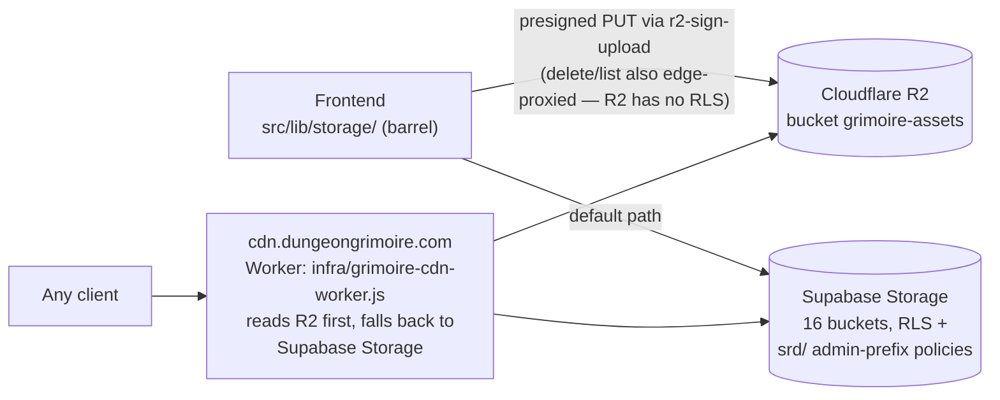

# Third-Party Integrations

Every external system Grimoire talks to, who initiates the call, which
credential it uses, and what breaks when it's down. The one-screen overview
lives in [index.md](index.md); this doc is the per-provider detail.

**Reading rule for outages:** the frontend only ever talks directly to
Supabase, Spotify, Google Cast, the CDN — and, for Pro BYOK campaigns, the AI
providers. *Everything else* goes through an edge function, so a non-Supabase
provider outage always surfaces as a failing `functions.invoke()` call.

## AI generation (text · image · music · 3D)

- **Model choice is DB-driven**, not hardcoded: `provider_config` table, read
  by `_shared/provider-config.ts` with a 5-min cache. "Wrong model / wrong
  cost" bugs start in the admin panel's provider config, not in code.
- **Two call paths.** Platform keys (in `platform_api_keys`, credit-metered)
  run through edge functions. **BYOK** (Pro-only, enforced server-side) calls
  providers straight from the browser with per-campaign keys decrypted via the
  `api-key-vault` edge function (`VAULT_KEY`). A BYOK bug can therefore be
  CORS/key-shaped and never appear in edge-function logs.
- **Embeddings** (`embed-content`, `embed-monsters` → 8 pgvector
  `*_embeddings` tables) are platform-wide single-provider, pinned to 1536
  dims, never BYOK. Retrieval feeds the generators (RAG).
- **Simulacrum/Meshy** is asynchronous: `forge-mini` creates the task, the
  every-minute `poll-meshy-jobs` cron (pg_net → edge function, bearer
  `SIMULACRUM_POLLER_TOKEN` from Vault) polls and downloads results.
  *Symptom:* minis stuck "sculpting" → check the cron job and poller token
  before Meshy itself.
- Stale-job hygiene is cron too: `fail-stale-image-jobs`,
  `fail-stale-ai-generation-jobs` (5 min), `release-stale-credit-holds`
  (15 min). *Symptom:* credits stuck "held" → those jobs.

## Billing — Stripe

- The webhook grants Pro and credits. **Webhook config lives in Stripe, not
  in the repo**, and test mode is a separate copy — CI's `stripe:check`
  (`scripts/check-stripe-webhook.ts`) asserts the live `enabled_events` +
  `api_version` match the code *before* migrations push, because three events
  were silently missing on 2026-08-01, including the one that grants Pro.
- *Symptom:* payment succeeded but no Pro/credits → webhook delivery
  (Stripe dashboard) → event-type parity → `stripe-webhook` logs, in that
  order. Refunds/disputes/fraud-warnings also arrive here.

## Media pipeline — Supabase Storage · Cloudflare R2 · CDN

- `VITE_ASSET_CDN_URL` unset (current production default) = everything served
  from Supabase Storage; the R2 config is all-four-env-vars-or-nothing and
  falls back silently (`R2UnavailableError`).
- Public URL contract: `cdn.dungeongrimoire.com/<bucket>/<path>` ==
  R2 key `<bucket>/<path>`. Worker runbook: `infra/README.md`.
- Shared/canonical art lives under the `srd/` prefix, user art under
  `{userId}/` — mixing them up is the wipe-all-canonical-art hazard
  (CLAUDE.md § Storage Path Convention).

## Content sources — Open5e

- Browser-side importers (`src/lib/library/open5eApi.ts` + per-entity
  importers) pull spells/creatures/items/species/backgrounds/classes/feats
  from `api.open5e.com/v2`, paginated 500 at a time.
- Server-side: `sync-srd-rules` edge function on a **weekly cron** upserts
  `/v2/rulesets` + `/v2/rules` into `library_rules`, keyed on
  `(source_document_key, source_record_key)` — those keys are Open5e's own;
  never rewrite them.
- *Symptom:* import wizard hangs/empty → Open5e API availability; rules
  content stale → the weekly cron.

## Audio — Freesound · Spotify · Cast · Lyria

- **Freesound**: edge-proxied (`freesound-search`, `FREESOUND_API_KEY`);
  only CC0/CC-BY results surfaced, previews rewritten to
  `cdn.freesound.org`.
- **Spotify**: entirely browser-side, per-campaign client ID, PKCE (no
  secret). Playback SDK from `sdk.scdn.co`; requires Spotify Premium in
  practice. Token/refresh problems live in `src/lib/audio/spotifyAuth.ts`,
  not in any edge function.
- **Google Cast**: `useCast.ts` loads the sender SDK from `gstatic.com`;
  Chrome/Edge desktop + Android only.
- **Lyria (AI music)**: via Gemini API — edge `generate-music` (platform) or
  browser BYOK (`src/lib/audio/aiMusic.ts`).

## Email — Resend

`send-notification-email` → `api.resend.com` (`RESEND_API_KEY`,
`NOTIFY_FROM_EMAIL`). Only two triggers (note shared, session date proposed),
invoked fire-and-forget from the UI — **deliberately not a DB trigger** so
backup restores can't re-email people. No-ops silently when the key is unset;
recipients re-derived server-side. Auth emails (signup/reset) go through
Supabase's own SMTP config, outside this repo.

## GitHub

- **Bug reports**: `create-bug-report` edge function files issues on
  `irongollem/grimoire` with a fine-grained PAT (issues:write) stored
  encrypted in `platform_api_keys`. The repo is public, so no
  reporter-identifying data goes into issue bodies.
- **CI/CD**: see [release-pipeline.md](release-pipeline.md).

## Inbound surface (who calls *us*)

All edge functions with `verify_jwt = false` and their real auth:

| Caller | Endpoint | Actual auth |
| --- | --- | --- |
| Stripe | `stripe-webhook` | `Stripe-Signature` vs `STRIPE_WEBHOOK_SECRET` |
| pg_cron via pg_net (self) | `poll-meshy-jobs` | Bearer token vs `SIMULACRUM_POLLER_TOKEN` (Vault) |
| Calendar apps | `ical-feed` | Per-campaign random `ical_token` in the URL |
| MCP clients (claude.ai etc.) | `mcp` | Supabase OAuth 2.1 JWT (dynamic client registration on; consent at `/oauth/consent`), RLS-scoped |
| Browser, may be anonymous | `create-bug-report` | Validated in code |
| Browser, authenticated | `stripe-create-*` | JWT verified manually (so typed JSON errors can be returned) |

No inbound webhooks exist from Meshy, Resend, Freesound, Open5e, Spotify or
GitHub — those are all outbound-only or polled. If a request claims to be
from one of them, it isn't.

## Monitoring — deliberately none (know this before an outage)

There is **no** Sentry/PostHog/Datadog/analytics of any kind; `index.html`
loads no third-party scripts. Error visibility is: Supabase dashboard logs
(edge functions, Postgres, Auth), Stripe dashboard (payments/webhooks),
Vercel dashboard (frontend deploys), GitHub Actions (CI), and user-filed bug
reports via `create-bug-report`. When tracing an outage, those five dashboards
are the complete observability surface.

## Credentials map (where a secret lives decides where it can leak or break)

| Scope | Store | Keys |
| --- | --- | --- |
| Frontend build (public) | Vercel env (`VITE_*`) | Supabase URL + anon key, CDN URL, Spotify dev client ID, marketing URL |
| Edge functions | Supabase secrets | service-role key, `VAULT_KEY`, Stripe secret + webhook secret, Resend, Freesound, `SIMULACRUM_POLLER_TOKEN` |
| Database (pg_net callers) | Supabase Vault | `marketing_deploy_hook`, `simulacrum_poller_url/token` |
| CI | GitHub Actions secrets | `SUPABASE_ACCESS_TOKEN`, `PRODUCTION_DB_PASSWORD`, `PRODUCTION_PROJECT_ID`, `STRIPE_SECRET_KEY` |
| Per-campaign (BYOK) | `platform_api_keys`-style encrypted rows via `api-key-vault` | OpenAI / Anthropic / Gemini keys, Spotify client ID |
