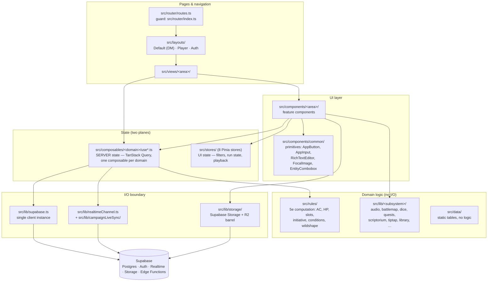
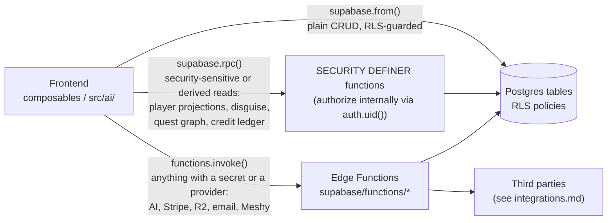
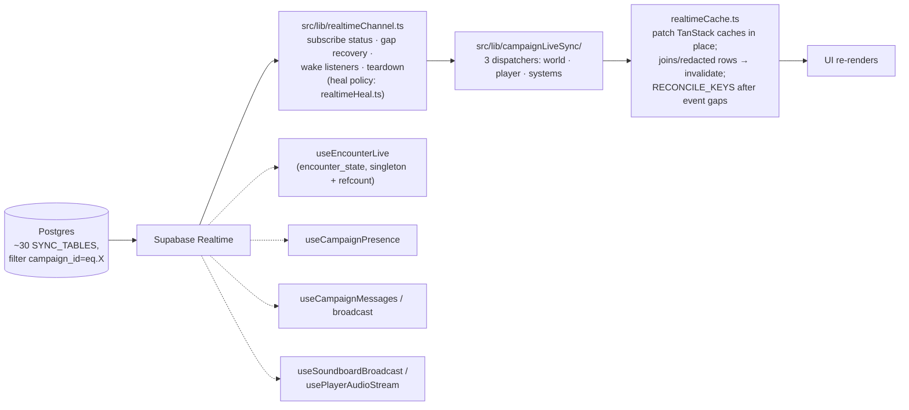
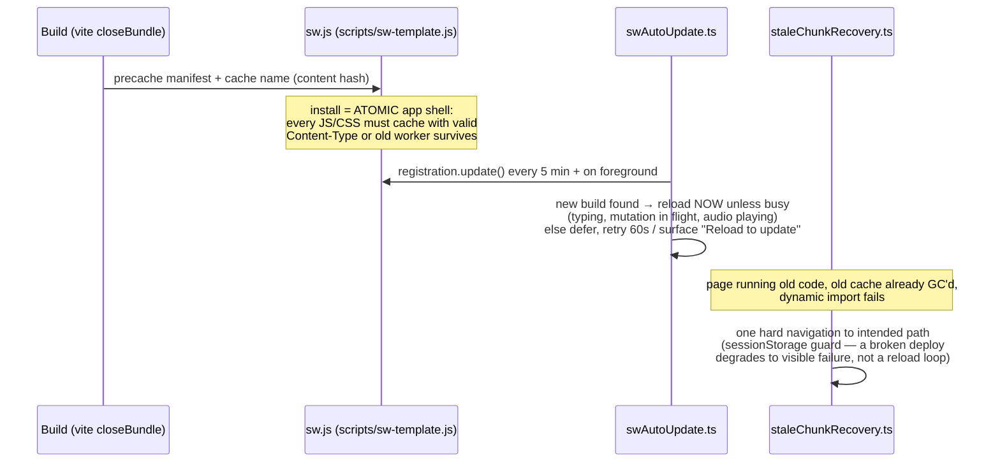

# Internal Application Architecture

How the frontend is layered, where state lives, and how data moves. For
*what each feature does*, read [`../features/index.md`](../features/index.md) —
this doc is about the shapes that every feature shares.

Stack: Vue 3.5 + TypeScript + Vite 8 (rolldown) · Vue Router 5 · Pinia 4 +
TanStack Query 5 · Tailwind v4 (no config file; tokens in `src/assets/*.css`) ·
Reka UI · Tiptap v3 · `@supabase/supabase-js`. Hand-rolled service worker (no
Workbox / vite-plugin-pwa).

## The layer diagram

Every feature follows the same vertical. If a bug report names a feature,
walk this stack top-down; the layer names below are literal directory names.

Two deliberate separations that look mergeable but are not:

- `src/cartographer/` (tile-pack **authoring** tool) vs `src/lib/battlemap/`
  (live encounter **runner** math). Do not merge — see CLAUDE.md § Module
  Placement.
- `src/ai/` holds one composable per AI generator plus the credit/quota
  composables; the generators call **edge functions**, never providers
  directly (provider keys live server-side or in the per-campaign vault).

## State management: two planes, never mixed

| Plane | Lives in | Shape |
| --- | --- | --- |
| **Server state** | `src/composables/<domain>/use*.ts` (a few UI/platform primitives stay at `src/composables/` root) | `useQuery`/`useMutation` wrapping module-private `fetchX/createX/…` that call `supabase.from(...)`. Query keys are `[QUERY_KEY, activeCampaignId]`, gated on an active campaign. Global defaults in `src/main.ts`: `networkMode: "always"`, `staleTime: 60s`, no refetch-on-focus. |
| **UI state** | `src/stores/` (Pinia) | Filters/sort/search (**always** `ui.ts` — the Filter State Pattern), run state, playback state. |

The 8 stores and their roles:

| Store | Role |
| --- | --- |
| `auth.ts` | Supabase session, campaign membership, `isAppAdmin`/`isDM`/`isPlayer`; feeds the router guard and `setCachedUser()` |
| `campaign.ts` | `activeCampaignId` (localStorage-persisted) — the key nearly every query is scoped by; BYOK API-key decryption |
| `ui.ts` | All list filters + per-feature UI modes + `dmPreviewMode` (mandated by CLAUDE.md) |
| `encounterRun.ts` | Live combat run state. Deliberately UI-only: DB writes are injected via `setPersistHandler`, dice via `InitiativeRoller` |
| `soundboard.ts` | Playback, buses, ducking, playlist run state (audio objects held non-reactive at module level) |
| `spotify.ts` | Spotify Web Playback SDK device + transport |
| `calendar.ts` | Active calendar adapter, custom campaign calendars |
| `cardForge.ts` | Card size/style/selection, collections in localStorage |

## Data access: three verbs

Roughly **209** direct table reads/writes, **71** RPCs, **40** edge-function
invocations. Which verb a feature uses tells you where to debug it:

- A bug in plain CRUD → check RLS policies and the composable.
- A bug in an RPC → the function body in `supabase/migrations/` (authorization
  rules in CLAUDE.md § SECURITY DEFINER).
- A bug involving AI/billing/storage/email → the edge function, then the
  provider ([integrations.md](integrations.md)).

## Realtime sync (live multi-user)

One campaign-wide channel, reference-counted, mounted once per layout
(`DefaultLayout` / `PlayerLayout`) via `useCampaignLiveSync`:

Rules the reducers obey: an event may **patch** an already-loaded cache but
never **create** one; anything the reducer can't reproduce exactly (joins,
redacted player projections) falls back to targeted invalidation.

**Symptom → cause:** "player doesn't see DM's change until reload" is either
the table missing from `SYNC_TABLES` (`campaignLiveSync`), a reducer patching
the wrong cache key, or channel death that healing didn't recover — check
`realtimeChannel.ts` status handling before suspecting the DB.

## Service worker & update lifecycle

Three cooperating modules (all wired in `src/main.ts`); the failure mode this
design guards is *stale chunks after deploy*:

One trap in that last step: Vite wraps every route `import()` in
`__vitePreload`, whose error path is `baseModule().catch(handlePreloadError)`,
and `handlePreloadError` re-throws **only** if nothing called `preventDefault`
on the `vite:preloadError` event — which `staleChunkRecovery` does. So the
import resolves to `undefined` and vue-router throws `Couldn't resolve
component "default" at "<path>"` instead of the engine's "failed to fetch
dynamically imported module". Classify with `isStaleChunkError`, never
`isChunkLoadError`, anywhere downstream of a route load; matching only the
engine text is what let DUNGEON-GRIMOIRE-3 through the Sentry filter.

Fetch policy: same-origin GET only; navigations race network vs 2.5 s timeout
→ cached `index.html`; assets cache-first. **Supabase and provider calls are
never cached** (cross-origin passes through), so the SW can be ruled out of
any data-staleness bug — it can only serve stale *code*.

## Where a new module goes

Codified in CLAUDE.md § Module Placement (decision table + the misfiling
post-mortems). Short version: 5e math → `src/rules/`; one-feature logic →
`src/lib/<feature>/`; multi-module subsystem → `src/lib/<name>/`; static
tables → `src/data/`; a lone utility with 3+ feature consumers → `src/lib/`
root. Tests are colocated, never `__tests__/`.
