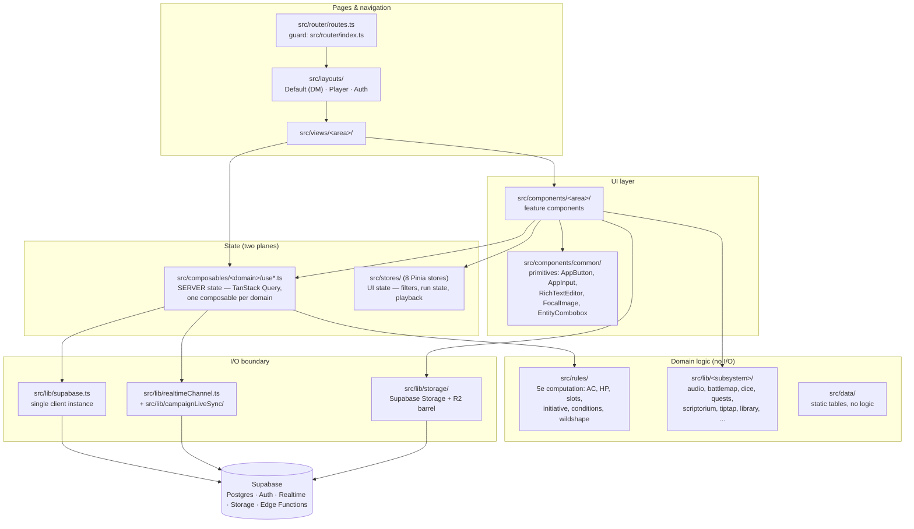
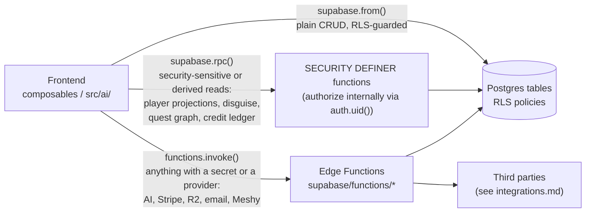
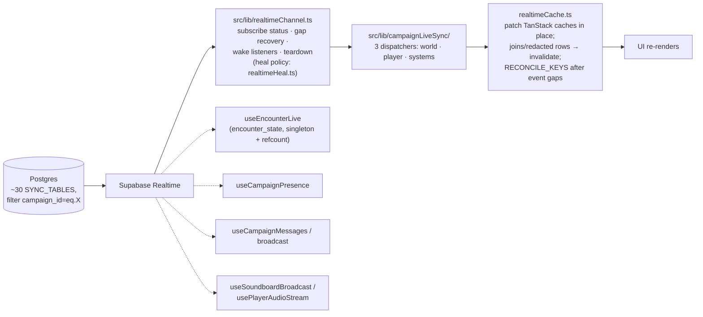
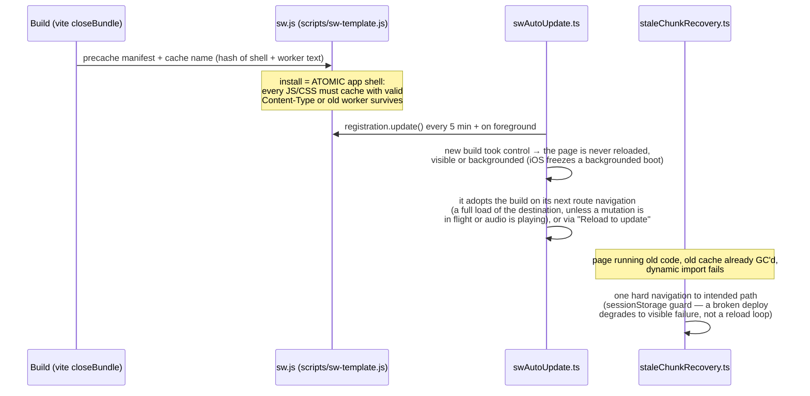

# Internal Application Architecture

How the frontend is layered, where state lives, and how data moves. For
*what each feature does*, read [`../features/index.md`](../features/index.md) —
this doc is about the shapes that every feature shares.

Stack: Vue 3.5 + TypeScript + Vite 8 (rolldown) · Vue Router 5 · Pinia 4 +
TanStack Query 5 · Tailwind v4 (no config file; tokens in `src/assets/*.css`) ·
Reka UI · Tiptap v3 · `@supabase/supabase-js`. Hand-rolled service worker (no
Workbox / vite-plugin-pwa).

## The layer diagram

Every feature follows the same vertical. If a bug report names a feature,
walk this stack top-down; the layer names below are literal directory names.

```mermaid
flowchart TB
    subgraph pages ["Pages & navigation"]
        router["src/router/routes.ts<br/>guard: src/router/index.ts"]
        layouts["src/layouts/<br/>Default (DM) · Player · Auth"]
        views["src/views/&lt;area&gt;/"]
    end

    subgraph ui ["UI layer"]
        components["src/components/&lt;area&gt;/<br/>feature components"]
        common["src/components/common/<br/>primitives: AppButton, AppInput,<br/>RichTextEditor, FocalImage, EntityCombobox"]
    end

    subgraph state ["State (two planes)"]
        composables["src/composables/&lt;domain&gt;/use*.ts<br/>SERVER state — TanStack Query,<br/>one composable per domain"]
        stores["src/stores/ (8 Pinia stores)<br/>UI state — filters, run state, playback"]
    end

    subgraph logic ["Domain logic (no I/O)"]
        rules["src/rules/<br/>5e computation: AC, HP, slots,<br/>initiative, conditions, wildshape"]
        lib["src/lib/&lt;subsystem&gt;/<br/>audio, battlemap, dice, quests,<br/>scriptorium, tiptap, library, …"]
        data["src/data/<br/>static tables, no logic"]
    end

    subgraph io ["I/O boundary"]
        client["src/lib/supabase.ts<br/>single client instance"]
        realtime["src/lib/realtimeChannel.ts<br/>+ src/lib/campaignLiveSync/"]
        storagelib["src/lib/storage/<br/>Supabase Storage + R2 barrel"]
    end

    supa[("Supabase<br/>Postgres · Auth · Realtime · Storage · Edge Functions")]

    router --> layouts --> views --> components
    components --> common
    views --> composables
    components --> composables
    components --> stores
    composables --> rules
    components --> lib
    composables --> client
    composables --> realtime
    components --> storagelib
    client --> supa
    realtime --> supa
    storagelib --> supa
```

Two deliberate separations that look mergeable but are not:

- `src/cartographer/` (tile-pack **authoring** tool) vs `src/lib/battlemap/`
  (live encounter **runner** math). Do not merge — see CLAUDE.md § Module
  Placement.
- `src/ai/` holds one composable per AI generator plus the credit/quota
  composables; the generators call **edge functions**, never providers
  directly (provider keys live server-side or in the per-campaign vault).

## State management: two planes, never mixed

| Plane | Lives in | Shape |
| --- | --- | --- |
| **Server state** | `src/composables/<domain>/use*.ts` (a few UI/platform primitives stay at `src/composables/` root) | `useQuery`/`useMutation` wrapping module-private `fetchX/createX/…` that call `supabase.from(...)`. Query keys are `[QUERY_KEY, activeCampaignId]`, gated on an active campaign. Global defaults in `src/main.ts`: `networkMode: "always"`, `staleTime: 60s`, no refetch-on-focus. |
| **UI state** | `src/stores/` (Pinia) | Filters/sort/search (**always** `ui.ts` — the Filter State Pattern), run state, playback state. |

**The query cache is memory-only, with one exception.** Shared library
content (the library lists, rules reference tables and licence lists named in
`src/lib/queryPersistence/policy.ts`) is also written to IndexedDB. The read
is lazy: a `persister` installed as a query default in `src/main.ts` wraps
every queryFn, and the first fetch of a listed key in a page session is
answered from disk instead of the network, so a cold start does not download
the 1.5 MB monster library again. Nothing is restored up front, so the mount
never waits on the disk. The wake-up heal in `App.vue` skips the same keys.
A stored record belongs to one account: it is only served to the user id that
wrote it, and the store is emptied on sign-out and on a signed-out boot. A
record is trusted for 24 hours and for one build; older, or written by another
build, it is shown and refetched in the background. After a week it is a miss.

Campaign and user data is deliberately **not** on that list, and `gcTime` is
left at its 5-minute default for the same reason. Most editors copy their
record into a form once and save the whole record with no concurrency check
(#946), so a stale cached copy shown at mount survives the background refetch
and a save reverts newer edits. Do not widen either until #946 is fixed.

The 8 stores and their roles:

| Store | Role |
| --- | --- |
| `auth.ts` | Supabase session, campaign membership, `isAppAdmin`/`isDM`/`isPlayer`; feeds the router guard and `setCachedUser()`. Boots from a per-user snapshot of membership, username and child link (`src/lib/authSnapshot.ts`) and re-reads them in the background, so the app mounts without waiting on those three reads. A token refresh that is slow (over 4 s) or fails for want of a network starts the app on the session auth-js has stored (`src/lib/persistedSession.ts`) rather than as signed out; only a refresh the server rejects signs out. Auth and data requests carry a deadline (`src/lib/requestDeadline.ts`), because a request frozen by iOS never answers and a refresh among them held the auth lock for good |
| `campaign.ts` | `activeCampaignId` (localStorage-persisted) — the key nearly every query is scoped by; BYOK API-key decryption |
| `ui.ts` | All list filters + per-feature UI modes + `dmPreviewMode` (mandated by CLAUDE.md) |
| `encounterRun.ts` | Live combat run state. Deliberately UI-only: DB writes are injected via `setPersistHandler`, dice via `InitiativeRoller` |
| `soundboard.ts` | Playback, buses, ducking, playlist run state (audio objects held non-reactive at module level) |
| `spotify.ts` | Spotify Web Playback SDK device + transport |
| `calendar.ts` | Active calendar adapter, custom campaign calendars |
| `cardForge.ts` | Card size/style/selection, collections in localStorage |

## Data access: three verbs

Roughly **209** direct table reads/writes, **71** RPCs, **40** edge-function
invocations. Which verb a feature uses tells you where to debug it:

```mermaid
flowchart LR
    app["Frontend<br/>composables / src/ai/"]

    app -- "supabase.from()<br/>plain CRUD, RLS-guarded" --> tables[("Postgres tables<br/>RLS policies")]
    app -- "supabase.rpc()<br/>security-sensitive or derived reads:<br/>player projections, disguise,<br/>quest graph, credit ledger" --> rpcs["SECURITY DEFINER functions<br/>(authorize internally via auth.uid())"]
    app -- "functions.invoke()<br/>anything with a secret or a provider:<br/>AI, Stripe, R2, email, Meshy" --> edge["Edge Functions<br/>supabase/functions/*"]
    rpcs --> tables
    edge --> tables
    edge --> ext["Third parties<br/>(see integrations.md)"]
```

- A bug in plain CRUD → check RLS policies and the composable.
- A bug in an RPC → the function body in `supabase/migrations/` (authorization
  rules in CLAUDE.md § SECURITY DEFINER).
- A bug involving AI/billing/storage/email → the edge function, then the
  provider ([integrations.md](integrations.md)).

## Realtime sync (live multi-user)

One campaign-wide channel, reference-counted, mounted once per layout
(`DefaultLayout` / `PlayerLayout`) via `useCampaignLiveSync`:

```mermaid
flowchart LR
    pg[("Postgres<br/>~30 SYNC_TABLES,<br/>filter campaign_id=eq.X")] --> rt["Supabase Realtime"]
    rt --> chan["src/lib/realtimeChannel.ts<br/>subscribe status · gap recovery ·<br/>wake listeners · teardown<br/>(heal policy: realtimeHeal.ts)"]
    chan --> dispatch["src/lib/campaignLiveSync/<br/>3 dispatchers: world · player · systems"]
    dispatch --> cache["realtimeCache.ts<br/>patch TanStack caches in place;<br/>joins/redacted rows → invalidate;<br/>RECONCILE_KEYS after event gaps"]
    cache --> uiL["UI re-renders"]

    rt -.-> enc["useEncounterLive<br/>(encounter_state, singleton + refcount)"]
    rt -.-> pres["useCampaignPresence"]
    rt -.-> msg["useCampaignMessages / broadcast"]
    rt -.-> snd["useSoundboardBroadcast /<br/>usePlayerAudioStream"]
```

Rules the reducers obey: an event may **patch** an already-loaded cache but
never **create** one; anything the reducer can't reproduce exactly (joins,
redacted player projections) falls back to targeted invalidation.

**Symptom → cause:** "player doesn't see DM's change until reload" is either
the table missing from `SYNC_TABLES` (`campaignLiveSync`), a reducer patching
the wrong cache key, or channel death that healing didn't recover — check
`realtimeChannel.ts` status handling before suspecting the DB.

## Service worker & update lifecycle

Three cooperating modules (all wired in `src/main.ts`); the failure mode this
design guards is *stale chunks after deploy*:

```mermaid
sequenceDiagram
    participant B as Build (vite closeBundle)
    participant SW as sw.js (scripts/sw-template.js)
    participant A as swAutoUpdate.ts
    participant R as staleChunkRecovery.ts

    B->>SW: precache manifest + cache name (hash of shell + worker text)
    Note over SW: install = ATOMIC app shell:<br/>every JS/CSS must cache with valid<br/>Content-Type or old worker survives
    A->>SW: registration.update() every 5 min + on foreground
    A->>A: new build took control → the page is never reloaded,<br/>visible or backgrounded (iOS freezes a backgrounded boot)
    A->>A: it adopts the build on its next route navigation<br/>(a full load of the destination, unless a mutation is<br/>in flight or audio is playing), or via "Reload to update"
    Note over R: page running old code, old cache already GC'd,<br/>dynamic import fails
    R->>R: one hard navigation to intended path<br/>(sessionStorage guard — a broken deploy<br/>degrades to visible failure, not a reload loop)
```

One trap in that last step: Vite wraps every route `import()` in
`__vitePreload`, whose error path is `baseModule().catch(handlePreloadError)`,
and `handlePreloadError` re-throws **only** if nothing called `preventDefault`
on the `vite:preloadError` event — which `staleChunkRecovery` does. So the
import resolves to `undefined` and vue-router throws `Couldn't resolve
component "default" at "<path>"` instead of the engine's "failed to fetch
dynamically imported module". Classify with `isStaleChunkError`, never
`isChunkLoadError`, anywhere downstream of a route load; matching only the
engine text is what let DUNGEON-GRIMOIRE-3 through the Sentry filter.

**And the same `undefined` reaches anything else that awaits a dynamic import,
where no classifier gets a look at all.** `main.ts`'s browser-only setup block
is a `Promise.all` of four imports outside the router, so a swallowed chunk
resolved one slot to `undefined` and the destructuring in `.then` threw
`Cannot destructure property 'onWakeLockVisibilityChange'…` as an *unhandled
rejection* — DUNGEON-GRIMOIRE-8, one client on a tab three commits behind,
13 Sep 2026. `beforeSend` could not filter it: `isStaleChunkError` matches
messages, and a TypeError about destructuring looks nothing like a chunk-load
error.

So the rule is not only "classify with `isStaleChunkError` downstream of a
route load" but: **never destructure the result of a dynamic import that
`preventDefault` can swallow.** Check the modules first and return quietly if
any is missing — there is nothing to install when the chunk never arrived, and
the reload is already in flight. Filtering the report would have been the wrong
fix; not throwing is the right one.

The visible-page rule exists because reloading a page the user has just
returned to is what they experience as the app being slow (#945): the
foreground update check found the new worker and the page reloaded in their
face, on most returns, since several builds ship a day. `main.ts` owns the
navigation half: `installNavigationReload` registers a global `beforeEach` that
asks `takeNavigationReload()` and turns the navigation into
`location.assign(destination)`. In-component leave guards run before it, so an
editor with unsaved work has already been asked.

That guard can also take the **first** navigation, and the mount has to know.
A cold start after a deploy boots the previous build (see the fetch policy
below), the update check swaps the worker while the auth guard is still
awaiting the session, and if that guard then redirects (a player's `/` goes to
`/play`) the redirect passes through the reload guard a second time, which now
takes it. vue-router reports an aborted first navigation by rejecting
`router.isReady()`, and `main.ts` mounts on that promise, so the rejection used
to surface as an unhandled `Error` with no message (DUNGEON-GRIMOIRE-G, 2 Oct
2026). Nothing was broken for the user, the page was already loading the new
build, but it would have fired for every redirected cold start after every
deploy. The guard returns a probe saying it has handed the page to the browser;
the mount swallows the rejection only when that probe is true and rethrows
anything else, because any other rejected first navigation is a real boot
failure that must keep reaching Sentry.

Fetch policy: same-origin GET only; navigations are answered with the cached
`index.html` and no network request (the network is used only when no shell is
cached anywhere: a worker whose cache the next deploy's activate swept mid-request
takes the new deploy's shell rather than answering `Response.error()`), so a cold start never waits on a waking radio for a document it
already has. The first load after a deploy therefore boots the previous build,
which the update check then replaces; assets cache-first. **Supabase and provider calls are
never cached** (cross-origin passes through), so the SW can be ruled out of
any data-staleness bug — it can only serve stale *code*.

## Where a new module goes

Codified in CLAUDE.md § Module Placement (decision table + the misfiling
post-mortems). Short version: 5e math → `src/rules/`; one-feature logic →
`src/lib/<feature>/`; multi-module subsystem → `src/lib/<name>/`; static
tables → `src/data/`; a lone utility with 3+ feature consumers → `src/lib/`
root. Tests are colocated, never `__tests__/`.
