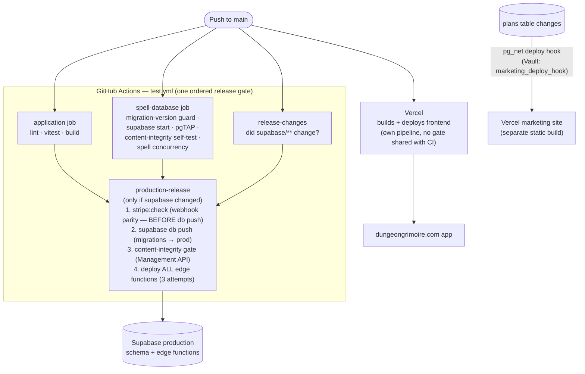

# Release Pipeline & Deploy Topology

How a merged commit becomes production, and — more importantly for outage
tracing — the fact that **one push fans out into two independent deploy
pipelines** that can land at different times or one-without-the-other.

## The two pipelines

Separate PR-time check: `supabase-migrations.yml` applies all migrations to a
throwaway Postgres on any PR touching `supabase/migrations/**`.

## The three skew windows (root cause of past red releases)

1. **Frontend ahead of schema.** Vercel deploys on every main push;
   migrations only push when CI's gates pass *and* `supabase/**` changed. A
   migration rejected by `db push` (e.g. a version at or below the newest
   applied — the #649 release kill) means the app ships against a schema that
   never got the change. *Symptom:* new UI erroring on missing
   column/RPC → compare Vercel deploy time vs the `production-release` run.
2. **Schema ahead of functions.** Inside `production-release`, `db push`
   lands before `functions deploy`, and function bundling resolves deps over
   the network (esm.sh/deno.land) at deploy time — a CDN blip after a
   successful push leaves schema ahead of function code (happened: run
   30668249029, a 522 from esm.sh). The deploy retries 3×; if it still fails,
   **re-run the job before assuming the release landed**.
3. **Stripe config vs code.** Webhook `enabled_events` live in Stripe, not
   the repo. `stripe:check` runs before `db push` so a mismatch fails while
   production is untouched — if that check was skipped (missing
   `STRIPE_SECRET_KEY`, surfaced as a CI warning), config drift is invisible
   until a customer pays and gets nothing.

## Migration rules that exist because of this pipeline

Full detail in CLAUDE.md § Supabase Migration Rules; the pipeline-relevant
core:

- Versions come from `/new-migration` / `supabase migration new` — never
  hand-picked (`scripts/check-migration-versions.sh` enforces uniqueness and
  lands-after-main in CI).
- A migration that sat on a branch while others merged must be **renamed
  forward before merge** — otherwise mode 2 above.
- Never run `supabase db push` by hand (it would apply other sessions'
  unmerged migrations); CI is the only pusher.
- `supabase/checks/content_integrity.sql` gates the deploy after `db push`;
  any new text-id reference to shared content must be added there in the same
  migration.

## Client-side rollout (after Vercel deploys)

Users don't get the new build instantly — the service worker adopts it:
poll every 5 min / on foreground, reload immediately unless the user is
mid-typing/mutation/audio (then deferred with a "Reload to update" action),
with `staleChunkRecovery` as the one-reload backstop for the old-code /
new-cache window. Details in [internal.md](internal.md) § Service worker.
*Symptom:* "user on old version hours after deploy" → they had a deferral
condition held open (long text entry, playing audio) — not a deploy failure.
