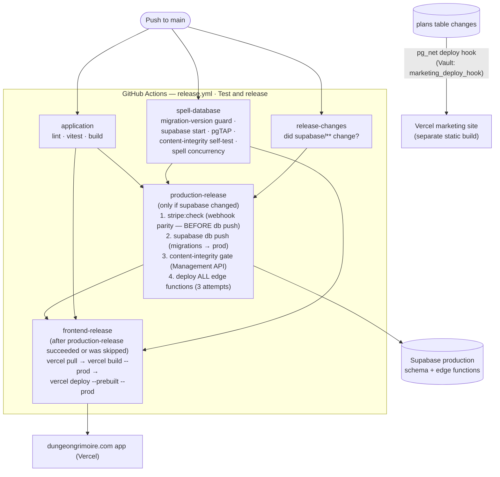

# Release Pipeline & Deploy Topology

How a merged commit becomes production, in what order, and where the
remaining windows are for outage tracing.

**One push, one ordered pipeline** — `.github/workflows/release.yml`
("Test and release"). The frontend used to deploy separately, straight from
Vercel's Git integration and in parallel with the backend; since 19 Sep 2026
it ships last, from the commit CI tested, only after the backend it calls.

## The pipeline

`production-release` and `frontend-release` share the concurrency group
`supabase-production` and are never cancelled, so releases queue in order and
an older run cannot deploy over a newer one.

**Vercel's Git integration no longer deploys `main`** (`vercel.json`:
`"git": { "deploymentEnabled": { "main": false } }`). Preview deploys for
other branches and PRs are unaffected. `frontend-release` needs the
`VERCEL_TOKEN` / `VERCEL_ORG_ID` / `VERCEL_PROJECT_ID` repository secrets and
fails loudly without them — with the Git deploys off, a skipped job would mean
nothing ships. A red test run now also blocks the frontend, which it never did
before.

Separate PR-time check: `supabase-migrations.yml` applies all migrations to a
throwaway Postgres on any PR touching `supabase/migrations/**`.

## The skew windows (root cause of past red releases)

1. **Frontend ahead of the backend — closed by ordering, 19 Sep 2026.** Vercel
   used to deploy on every main push while migrations and functions shipped
   only after CI. That window shipped #649 against a schema that never got its
   migration (9 Aug), and on 18 Sep the import review went live minutes before
   the `import-match` function it calls (a 404 for every DM) while pages were
   still being extracted with the previous prompt. `frontend-release` now runs
   after `production-release`. *If a new UI errors on a missing column, RPC or
   function anyway,* check whether `production-release` failed — the frontend
   job does not run after a failed backend release, so a new UI in front of an
   old backend means something bypassed CI (a manual `vercel deploy`).
2. **Schema ahead of functions.** Inside `production-release`, `db push`
   lands before `functions deploy`, and function bundling resolves deps over
   the network (esm.sh/deno.land) at deploy time — a CDN blip after a
   successful push leaves schema ahead of function code (happened: run
   30668249029, a 522 from esm.sh). The deploy retries 3×; if it still fails,
   **re-run the job before assuming the release landed**.
3. **Stripe config vs code.** Webhook `enabled_events` live in Stripe, not
   the repo. `stripe:check` runs before `db push` so a mismatch fails while
   production is untouched — if that check was skipped (missing
   `STRIPE_SECRET_KEY`, surfaced as a CI warning), config drift is invisible
   until a customer pays and gets nothing.

## Migration rules that exist because of this pipeline

Full detail in CLAUDE.md § Supabase Migration Rules; the pipeline-relevant
core:

- Versions come from `/new-migration` / `supabase migration new` — never
  hand-picked (`scripts/migration-rebase` enforces uniqueness and
  lands-after-main in CI).
- A migration that sat on a branch while others merged must be **renamed
  forward before merge** — otherwise mode 2 above.
- Never run `supabase db push` by hand (it would apply other sessions'
  unmerged migrations); CI is the only pusher.
- `supabase/checks/content_integrity.sql` gates the deploy after `db push`;
  any new text-id reference to shared content must be added there in the same
  migration.

## Client-side rollout (after frontend-release deploys)

Users don't get the new build instantly — the service worker adopts it:
poll every 5 min / on foreground, reload immediately unless the user is
mid-typing/mutation/audio (then deferred with a "Reload to update" action),
with `staleChunkRecovery` as the one-reload backstop for the old-code /
new-cache window. Details in [internal.md](internal.md) § Service worker.
*Symptom:* "user on old version hours after deploy" → they had a deferral
condition held open (long text entry, playing audio) — not a deploy failure.
